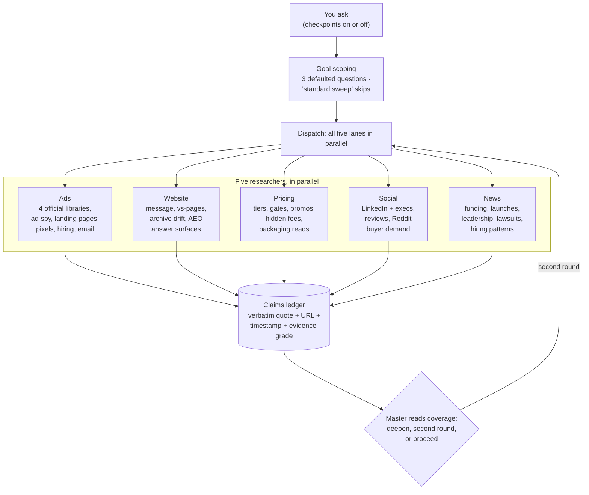
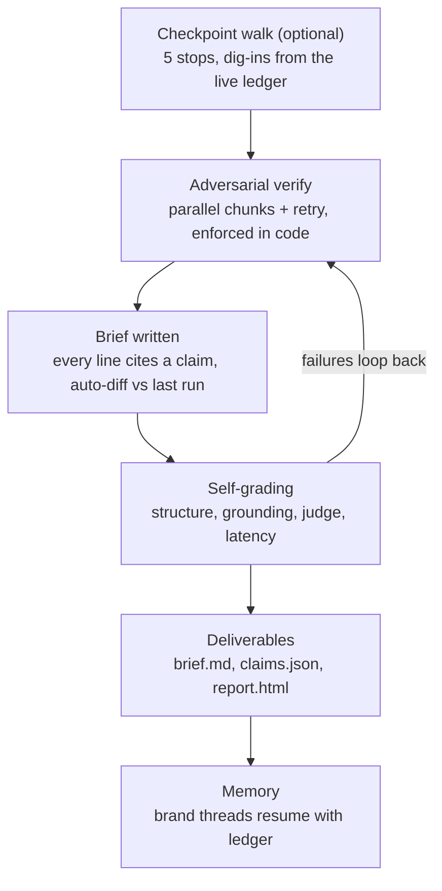

# How this agent is evaluated, and where the proof lives

This document is the design rationale behind Pranav's GTM Agent: why it is structured the way it is, what it runs on, and how it grades itself. It is written against the five questions any serious evaluation of an agent like this asks, and every claim points at evidence in the repo. A machine-readable twin ships as `DESIGN.json`.

## Does the agent work?

Point it at any competitor in or adjacent to Rippling's space and it produces an evidence-graded brief plus a claims ledger where every quote re-verifies against the live web.

- `outputs/` holds six eval-passed audits: Gusto, BILL (twice), Deel, Ramp, Justworks, BambooHR.
- On the Deel run, the grounding checker re-found 43 of 43 measured quotes verbatim on the live pages.
- The LLM judge, a "demanding Rippling VP of Growth" rubric, scored the Gusto, BILL and Deel briefs 5/5 overall.
- Two research rounds per audit are typical. On Deel, the master self-corrected a wrong round-1 conclusion after round-2 evidence contradicted it.

## Architecture quality

A real decision-making loop, not a pipeline. The master chooses lanes per competitor, sharpens per-researcher focus, routes failures, decides when a second round is worth the money, and declines work that will not change conclusions.

- Observed live: the master declined a third research round on Deel, stating no strategic conclusion was waiting on more evidence.
- Goal-discovery intake: before spending, it asks (with defaults) what the audit feeds, which product motion matters, and which hypotheses to pressure-test. The answers become per-lane focus notes.
- Checkpoint walk: research runs fully parallel, then findings are presented as five interactive stops where the user can dig into the live ledger before the report exists.

## Tool usage

The right tool per job, and every source failure is routed, never surfaced as an error or silently swallowed.

- Each ads researcher works a four-tier source ladder: official ad libraries, then ad-spy aggregators, then the landing pages ads point to, then pixel, traffic and hiring signals. It descends automatically when walled.
- Coverage gaps are disclosed exactly once, honestly, in the brief's section 8, together with the fallback that was used.
- Live example: Meta's Ad Library renders empty to automated fetches. The run recorded it, fell back to third-party libraries, and a rendered-browser retry later captured the measured creative set.

## Output quality

The brief is campaign-ready, and section 7 (Rippling gaps and opportunities) is anchored to cited claims rather than generic advice.

- The structural eval requires at least five citations inside the Rippling section alone; recent runs carry sixty or more.
- Section 7 pairs declared strategy against actual buyer demand (what their ads say versus what buyers complain about), names segments and channels, and ends with a citation-anchored kill sheet.
- Every claim carries a verbatim quote, URL, timestamp, evidence grade and verification state. The ledger ships as JSON plus a filterable HTML report.

# The map

The whole formation on one page. Research and conversation are deliberately decoupled: the five researchers always fire in parallel, and the checkpoint walk paces the findings, never the work.

The master's decision point is where the two halves meet: once no open question would change the conclusions, the formation moves from gathering evidence to defending it.

# Architecture decisions

Each decision records the reason and the tradeoff knowingly accepted.

## Hand-written agent loop, no framework

The agentic loop is the product. A framework would hide exactly the decisions worth seeing: which lanes to run, how to route failures, when to stop. Roughly seven hundred lines of visible Python means every decision point is auditable.

*Tradeoff accepted:* no framework conveniences; retries and tracing are hand-rolled.

## A formation, not a pipeline

Master orchestrator, five parallel lane researchers, an adversarial verifier, a brief writer. Research is parallelizable and needs materially different context per lane (different playbooks, sources, budgets); judgment is not parallelizable and needs one owner. The operating rule: parallelize sources, never judgment. Verification lives in a fresh context because a context that generated claims will defend them.

*Tradeoff accepted:* coordination overhead and compressed handoffs, mitigated by making the handoff artifact structured data (the ledger with verbatim quotes), never prose summaries.

## The claims ledger as the spine

Append-only rows with an ID, verbatim quote, URL, timestamp, evidence grade (measured, stated-by-competitor, proxy, inferred) and verification state. The brief cites claim IDs inline so every sentence is auditable back to a URL. The ledger doubles as session state (follow-ups reuse it instead of re-researching) and as longitudinal memory: dated JSONs live in git, and re-runs auto-diff against the prior run to answer "what changed".

*Tradeoff accepted:* claims regenerate IDs each run, so cross-run matching uses stable evidence (URLs and quote fingerprints) instead of IDs.

## Goal-discovery intake before any spend

The same audit should be shaped differently for campaign plays, a sales battlecard, or an exec readout. One message, at most three defaulted questions; "standard sweep" skips. Answers travel into lane focus notes and the brief's section-7 emphasis.

*Tradeoff accepted:* one extra conversational turn before research starts.

## Failure is data, resolved silently

The public web actively resists automated reading. Every single run hit three to five blocked sources: JS walls, 403s, 404s. Researchers auto-descend a source ladder and keep partial reads; the master never surfaces plumbing to the user; gaps are disclosed once in section 8 where they belong. Without this, briefs read confident while whole evidence categories are missing.

*Tradeoff accepted:* some fallback reads are proxy-grade, which is why evidence grades exist and confidence is capped accordingly.

## No RAG, no vector store

Marketing intel dies stale: pricing, homepage messaging and active ads change weekly, and "what changed recently" is a required output. Retrieval is the live web at run time, steered mid-run by the master. Grounding is the whole ledger held in context, because cross-lane synthesis needs the full picture, not top-k chunks. Provenance must re-verify against live pages.

*Tradeoff accepted:* no cross-session semantic search; longitudinal memory is the dated-ledger diff instead.

## Verification enforced in code, not by prompt

Under speed pressure the master once sampled 14 of 101 claims for verification and went to print. The eval harness caught it (a 13% pass-rate). Now `write_brief` itself auto-verifies anything unjudged before writing. Judgment gets a gate, not a suggestion.

*Tradeoff accepted:* a brief written after a huge multi-round ledger pays a verification delay it cannot skip.

## One Session, three frontends

The Session emits structured events. The CLI prints them; the web UI renders them as live cards; brand threads reload prior conversation plus the brand's ledger so follow-ups continue with full context. One loop means a behavior fixed once is fixed everywhere, and a reviewer can literally watch decide, dispatch, verify happen.

*Tradeoff accepted:* the server keeps in-memory named sessions; a process restart drops live threads, whose transcripts and ledgers persist on disk and re-seed.

## The checkpoint walk is decoupled from research

Conversational pacing without wall-clock cost: all five researchers fire in parallel as usual, then findings are walked one lane at a time with "dig in or continue?" stops answered from the live ledger. It is an interaction layer, not an execution layer.

*Tradeoff accepted:* checkpoint stops add user-paced latency to the final report when enabled, by design.

# Tool and model choices

## Opus for judgment, Sonnet for extraction

The master, adversarial verifier, brief writer and LLM judge run the flagship model. The five lane researchers run `claude-sonnet-5` with an eighteen-claim cap per lane. Researchers execute tight playbooks, so a faster model loses little there and cut lane wall-time roughly in half; synthesis, adversarial verification and section-7 judgment are where model quality shows. Judgment tasks punish weaker models invisibly: a verifier must resist agreeing with plausible claims, and a weak master produces briefs that look fine and are strategically empty. The economics also run opposite to intuition: judgment calls are few, researcher calls burn the most tokens, so the flagship premium on judgment costs little while the fast-model saving on extraction is large. Everything is overridable via environment variables (`AGENT_MODEL`, `LANE_MODEL`, `JUDGE_MODEL`) — model tier is config, not architecture.

*Tradeoff:* the faster researcher model initially over-produced claims (38 in one lane); fixed with schema-enforced caps because every claim costs verification downstream.

## Server-side web search and fetch as the research tools

Anthropic's server tools with per-lane usage budgets, plus seed URLs injected per lane: ad libraries, pricing pages, archives, pixel and traffic lookups. Zero scraping infrastructure for a reviewer to install; budgets enforced server-side; dynamic content filtering built in.

*Tradeoff:* JS-heavy surfaces may render empty. Handled as first-class coverage reporting plus the source ladder; a rendered-browser pull is the documented escalation rather than a bundled headless-browser dependency.

## Two runtimes, one formation

The `api` runtime uses the Anthropic API with schema-validated structured outputs, prompt caching, pause-and-resume handling and backoff. The `cli` runtime turns every model call into a `claude -p` subprocess billing a Claude subscription: zero API key. Reviewers without a key can run everything; the entire sample set was produced keyless. The CLI master loop is a JSON action protocol, still decide-execute-observe, hardened against transcript echo with a last-action parser, an anti-replay check and one corrective retry.

*Tradeoff:* the CLI runtime pays a cold-start tax per master decision (roughly 30-60 seconds each) and budgets become prompt instructions instead of hard server caps. Stated in the README.

## Structured outputs everywhere

On the API runtime, researcher, verifier and judge responses are schema-validated JSON at the API layer. No parse-and-pray: malformed output retries at the source instead of poisoning the ledger. The CLI runtime approximates this with defensive parsing plus one retry.

## Parallelism where it is free

Five researchers run in threads, so wall time approximates the slowest lane (two to three minutes). The verifier chunks the ledger, 24 claims per reviewer, and runs chunks in parallel with an automatic lower-concurrency retry for chunks that fail under load. This cut a 13-15 minute audit to six to eight minutes of formation work without touching judgment quality.

*Tradeoff:* parallel verifiers under heavy load can rate-limit, hence the retry round; unjudged claims are reported rather than silently passed.

## FastAPI, SSE, and a single-file web UI

`server.py` streams the Session's structured events; `ui/index.html` renders chat, live formation cards, the checkpoint tracker, audit history and resumable threads with no build step. A reviewer can read the whole frontend in one file. Single-user by design.

## Per-stage latency instrumentation

Every run records lane seconds, verify wall, brief wall and formation total into `run.timings` inside the claims JSON; the UI shows per-lane seconds live. Speed regressions are argued from receipts, not vibes, and slow now fails evals like a quality bug.

# The eval system

The same adversarial pressure the verifier applies to researchers, the harness applies to the whole agent. Nothing lands unverified; nothing ships uneval'd; every post-eval correction is logged inside the deliverable (`run.post_eval_corrections`) so the audit trail shows the harness catching things — which is the proof it works.

## Layer 1: structural checks

Free, deterministic, CI-ready exit code. Claims-JSON field and enum validity. Every non-inferred claim carries a verbatim quote. Source URLs must be real and fetchable; aggregate reads are graded inferred. All eight brief sections present. Fifteen or more distinct claim IDs cited, zero dangling citations, and the Rippling section alone carries five or more. Verification pass-rate at least 60% confirmed-plus-plausible. Latency budgets: slowest lane within 300 seconds, verify within 300, brief within 300, formation within 750.

## Layer 2: grounding spot-check

Network, no LLM. Re-fetch measured claims' URLs with a browser-grade user agent and fuzzy-match stored quotes against live page text: five-word shingles, 60% must hit. This is the anti-hallucination tripwire; a quote that is not on the page fails loudly. Its normalizations were learned from real false-fails: HTML entity unescaping, typographic quotes and dashes, tag-strip punctuation spacing.

## Layer 3: the LLM judge

One model call. A "demanding Rippling VP of Growth" scores the brief 1-5 on evidence-grounding, specificity, recency and Rippling-actionability, and returns named weaknesses that are treated as a fix list, not commentary.

## The logic flow

1. A run completes; brief, claims JSON and the claims-report HTML land in `outputs/`.
2. Structural checks run: format, citations, quotes, verification coverage, latency budgets.
3. Grounding re-fetches measured quotes against the live web.
4. The judge reads brief plus ledger and returns scores and named weaknesses.
5. Every finding becomes a correction: re-grade, re-verify, or fix the harness itself.
6. Corrections are appended to `run.post_eval_corrections` inside the claims JSON.
7. Evals re-run to green before the run is considered closed.
8. `tests/test_latency.py` proves dispatch and verify parallelism and timing persistence with a stub model: zero tokens, CI-ready.

## Track record: real catches

- Composite multi-fragment quotes stitched with ellipses were caught and replaced with single contiguous verbatim runs.
- Proxy fee claims over-graded as "confirmed", whose source platform blocks direct fetches, were downgraded to plausible.
- The master sampling 14 of 101 claims for verification under speed pressure was caught; verification is now enforced in code at `write_brief`.
- Placeholder source URLs were caught; the protocol now requires fetchable URLs and routes aggregates to inferred.
- A repair script renumbering claim IDs dangled five brief citations; IDs were recovered from the git snapshot and repairs now preserve IDs.
- The harness itself false-failing on bot-walled pages, HTML entities and curly quotes was root-caused against live pages and hardened.

# The end-to-end flow

1. The user names a competitor, with checkpoints on or off.
2. The master scopes the goal: one message, three defaulted questions (end goal, motion scope, hypotheses); "standard sweep" skips.
3. The master dispatches all five lane researchers in parallel, each with a sharpened focus note, per-lane budgets, and an eighteen-claim cap.
4. Researchers work their source ladders, auto-descending on walls; claims land in the append-only ledger with quotes, grades and timestamps.
5. The master reads the coverage report and decides: deepen a lane, run a second round, or proceed — never surfacing plumbing to the user.
6. In checkpoint mode, findings are walked five stops at a time, dig-ins answered from the live ledger, with a blind progress tracker at the side.
7. The adversarial verifier attacks every claim in parallel chunks with retry; `write_brief` force-verifies anything left unjudged.
8. The brief writer turns the verified ledger and the master's synthesis notes into the eight-section brief; re-runs auto-diff against the prior dated run.
9. Deliverables: the brief, the claims JSON with timings and the corrections log, and the filterable claims-report HTML.
10. The eval harness grades the run — structure, grounding, judge, latency — and failures loop back as fixes.
11. Audit history stores every exchange per brand; brand threads resume later with the conversation and ledger loaded.
